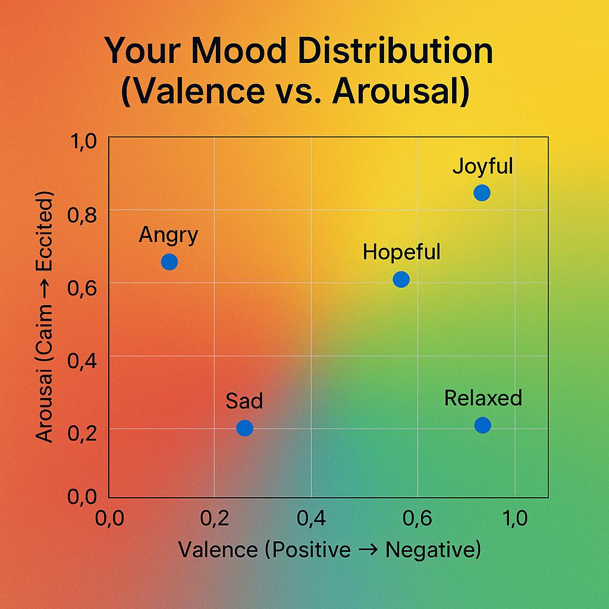

# Music Mood Recommender 🎵

An AI-powered music recommendation system that suggests playlists based on your mood and regional preferences.

## Demo


## Features 🌟
- 🤖 AI-powered mood detection
- 🎵 Spotify playlist recommendations
- 🌍 Multi-language support
- 🗺️ Region-specific music suggestions
- 🎤 Voice input capability
- 📊 Mood history tracking
- 🌙 Dark mode support
- 📱 Responsive design

## Quick Start 🚀

### Prerequisites
- Python 3.9 or higher
- Spotify Developer Account
- 2GB+ free disk space
- Internet connection

### Installation

1. Clone the repository
```bash
git clone https://github.com/yourusername/music-mood-recommender.git
cd music-mood-recommender
```

2. Create and activate virtual environment
```bash
python -m venv venv
# Windows
.\venv\Scripts\activate
# Unix/MacOS
source venv/bin/activate
```

3. Install dependencies
```bash
pip install -r requirements.txt
```

4. Set up environment variables
Create a `.env` file in the project root with:
```env
SPOTIFY_CLIENT_ID=your_client_id
SPOTIFY_CLIENT_SECRET=your_client_secret
DEBUG=True
SECRET_KEY=your_secret_key
```

5. Run the application
```bash
python app.py
```

Access the web interface at `http://127.0.0.1:5000`

## Getting Spotify API Credentials 🎸
1. Visit [Spotify Developer Dashboard](https://developer.spotify.com/dashboard)
2. Log in with your Spotify account
3. Create a new application
4. Copy the Client ID and Client Secret
5. Add them to your `.env` file

## Project Structure 📁
```
music_mood_recommender/
├── app.py              # Main Flask application
├── config.py           # Configuration settings
├── emoji_predictor.py  # Emotion detection logic
├── emotion_mappings.py # Emotion-emoji mappings
├── handlers.py         # Error handlers
├── requirements.txt    # Project dependencies
├── static/            # Static files
└── templates/         # HTML templates
```

## Contributing 🤝
1. Fork the repository
2. Create your feature branch (`git checkout -b feature/amazing-feature`)
3. Commit your changes (`git commit -m 'Add amazing feature'`)
4. Push to the branch (`git push origin feature/amazing-feature`)
5. Open a Pull Request

## Troubleshooting 🔧
Common issues and solutions:

1. **SSL Certificate Error**
   - Ensure Python includes SSL certificates
   - Update Python to latest version

2. **Model Download Issues**
   - Check internet connection
   - Verify disk space
   - Clear transformers cache

3. **Spotify API Errors**
   - Verify API credentials
   - Check API rate limits
   - Ensure valid redirect URIs

## License 📝
This project is licensed under the MIT License - see the [LICENSE](LICENSE) file for details.

## Acknowledgments 🙏
- Spotify API
- Hugging Face Transformers
- Flask Framework
- NLTK